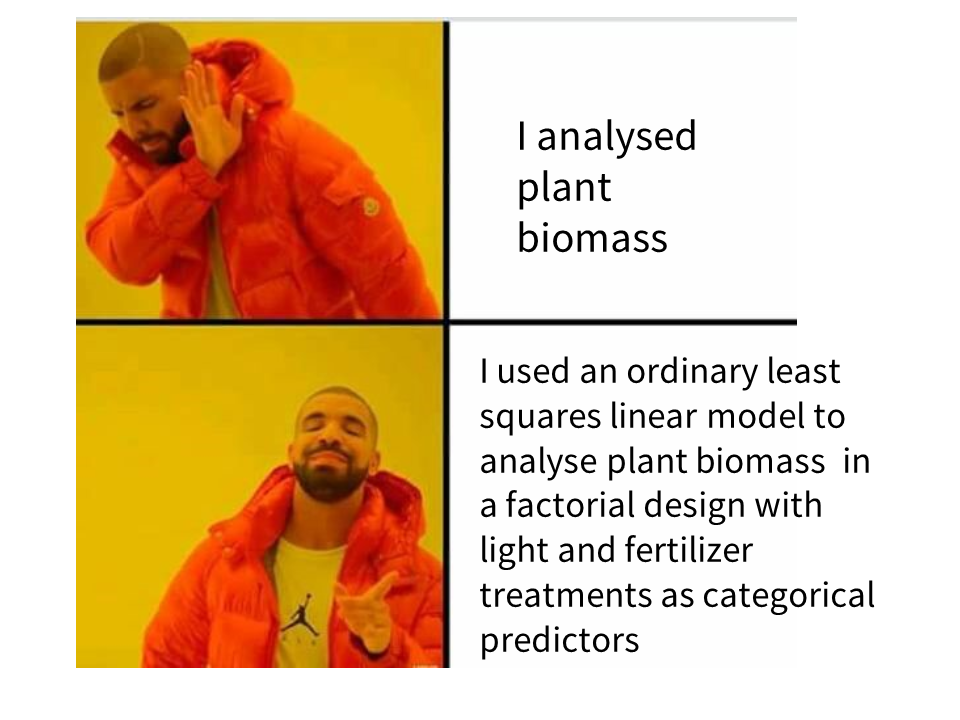

```{r setup, include=FALSE}
library(tidyverse)
library(kableExtra)
knitr::opts_chunk$set(echo = TRUE)
```

# 1. Outline


You are being given the choice of four possible datasets. 

With your chosen dataset you are tasked with using exploratory data analysis and background reading to develop hypotheses that you will test with robust linear models. You will then write-up and communicate your findings with a clear results section and good data visuals in the style of a paper/lab report.

You only need to analyse one data set, and you do not need to test *everything* within a dataset in order to make an excellent report. Planning and demonstration of thorough analysis of carefully chosen hypotheses with excellent write-ups and clear data visuals, is preferable to trying to study everything!

You have already carried out data cleaning, exploratory analysis and data visualisation in the course of completing your first assignment. This assignment extends that to include background reading and incorporating some simple statistics. 


## Hand-in

### GitHub Repository

Your project on Github should contain the following files:

1) A project README
2) A well presented R script(s) for data cleaning, exploratory analysis & model building
3) An Rmd document with outputs only that forms the lab report
4) The knitted pdf of your lab report

You can make commits and push these at any time up until the assignment deadline. 
That's all you need to do to save your code for the assignment. 
Check out this short video for a how-to guide: https://www.youtube.com/watch?v=pAcMgGbCtQw&feature=youtu.be

You should make regular, small and meaningful commits. 

Check you are pushing to GitHub by visiting `Tools > Project options > Git` to get the url of your project on Github.


### Report

Publish a report (file 4) as a pdf and hand-in through the assignment portal on Blackboard. 


# 2. Information on the datasets


Choose one data set to work on for your report.

    
## 2.1 The datasets in brief:

    
  - Studying the cost of singing in the decorated cricket, *Gryllodes sigillatus* 
  
  - Exploring the effect of annual temperature on body size in the butterfly *Hesperia comma*
  
  - Studying the effect of the gene *raga-1* on longevity and reproduction in the nematode worm (*C. elegans*)
  

              


## 2.2 Some ideas for analysis


Below I provide some hints  and ideas about how to make interesting reports for each of the datasets. Remember - you only need to analyse **ONE** dataset, and you don't need to analyse everything. 


### Cricket song

`cricket_song.csv`

A study of the relationship between, among other things, condition, resource availability (food quality) and sexual signalling (calling song) in the decorated cricket, *Gryllodes sigillatus*. Male crickets "sing" to attract females by rubbing specialised areas of their wings together, an activity which is energetically costly.


The important variables from our point of view is `Delta_smi` which is the change in weight over a week of study

| Variable            | Definition                              |
|---------------------|-----------------------------------------|
|Delta_smi      | Change in weight (g) |                      
| Diet      | Percentage nutritional content of the food the animal was fed    |
| Song_week1    | The total amount of time the cricket spent singing in the first week of the experiment   |
| Mass0    | Mass (g) at start of experiment  |
| Pronotum    | Size (mm) The pronotum is a prominent plate that covers the thorax and can be used as a proxy for body size |

### Size changes in a butterfly with temperature

`unvoltine_butterfly.csv`

Exploring the universal ecological responses to climate change in butterflies. This study uses museum specimens of the Silver Spotted Skipper, *Hesperia comma* to look at how size varies with annual temperature. 

- Think about possible covariates and collinearities

- Will males and females respond in the same way?


| Variable            | Definition                              |
|---------------------|-----------------------------------------|
| Year          | year of dated museum specimen |                      
| forewing length       | length (mm) of measured forewing        |
|sex    | sex of butterfly specimen       |
| JUN_mean | mean temperature in June of that year (celsius) |
| rain_JUN     | total rainfall (mm) for that year            |


### Studying the effect of the gene *raga-1* and how it interacts with stress on longevity and reproduction in the nematode worm (*C. elegans*) through gene knockout

- This is an *rnai* experiment to investigate the effect of a gene through knockdown

- Think about effects in terms of possible life-history effects on reproduction.

- *C.elegans* are used to test epigenetic effects, so does life history of parents (F0) affect their offspring (F1)?

> Use `readxl::read_excel` to import from excel spreadsheet

| Variable            | Definition                              |
|---------------------|-----------------------------------------|
| rnai            | dsRNA treatment of nematodes targeting either the raga gene or ev (empty vector control) for gene expression knockdown |                      
| treatment        |dark or light exposure to light or dark (light is a stress environment for the nematode)          |
| replicate/plate       | replicate an ID number for each experiment       |
| offspring | number of offspring produced |
| parental treatment      | light or dark conditions experienced by the subjects parents            |
| parental_rnai       | rnai treatment of the subjects parents |             


# 3. General guide to the report

- Word limit and document formatting:

    - The report and the appendix R code should be submitted as one pdf document.

    - The maximum length is 1500 words.
    
    - The 1500 word limit includes: title, main text (results & discussion), conclusion.

    - It does not include: plot legends, the R code in the supplementary methods (submitted separately as your Github classrooms repo) or the references.

## 3.1 Your report MUST have these sections

1. Title


2. Main text

    - Introduction
    
    - Analysis
    
    - Results
    
    - Discussion
    

3. References


## 3.2 Sections in detail

### Title
The title should describe your main question and/or your main result and what species you are using. We encourage interesting and enticing titles.
  

### Introduction
    
This section should start with a brief (one-paragraph) introduction section, where you provide a brief background, some context and present your carefully formed hypotheses for testing

### Analysis

1) Overview
Describe the problem. What substantive question are you trying to address? This needn’t be long, but it should be clear.

2) Data and model
What data did you use to address the question, and how did you do it? Did you have to apply any transformations, exclude any outliers?


When describing your approach, be specific. For example:

- Don’t say, “I ran an ANOVA” when you instead can say, “I used an ordinary least squares linear model to analyse plant biomass  in a factorial design with light and fertilizer treatments as categorical predictors”

- Justify important features of your modeling approach "The best fitting model to explain plant biomass included an interaction term". 


- State the R version used, and *briefly* R packages and why they were used. 



### Results and discussion

The ‘letter’ style manuscripts differ from article style, in that the main text contains
both results and discussion, blended together. To achieve this, each paragraph or
section should contain:

• a short descriptive header

• a question, query or hypothesis

• a test or analysis you performed

• the result (described verbally *and* in plots/tables)

  - **DO** include - Raw data figures, visual model summaries, model tables
  
  - **DON'T** include - Model checking plots, exploratory analysis

• a brief discussion/comment (1-2 sentences) discussing the biological
implications of the result, similar observations, mentioning any caveats, and/or
new questions, etc.


### Example

**Differential Gene Expression** <span style="color: red;">[Each paragraph has a heading]</span>


<span style="color: red;">[Hypothesis goes here]</span> I hypothesised that essential genes would be more highly expressed
than non-essential genes, because they are involved in central cellular processes for which more abundant proteins would be required. <span style="color: red;">[test]</span> To test this hypothesis, I compared
the protein expression levels of essential and non-essential genes using a general linear model with essential/non-essential gene as a factorial predictor variable against rank ordered protein expression levels.<span style="color: red;">[test]</span>  This analysis showed that essential genes have on average 1.3 fold (95% CI: 0.8-1.6) higher protein expression levels than non-essential genes (*F*~1,34~= 637, *P* <0.001, *R^2* = 0.94, Figure 1).
<span style="color: red;">[discussion/comment]</span> * Similar results have been observed in other species such as **x** 
<span style="color: red;">[citations]</span> , showing that this is a general trend of molecular biology. It is possible that
the majority of this result is due to ribosomal proteins. <span style="color: red;">[next paragraph might be a test of this conclusion]</span> .

<span style="color: red;">Don’t put these red markers in your own text!!!</span>

I have included papers from the journal BMC Biology in the GitHub Assignment - take a look at these for examples of how to structure this write-up style. 


#### Figures and Figure legends

Your intended audience for these figures are other scientists, your figure may be complex, but must be clear and accurate - and it must be supported by a great figure legend. 

A great figure legend has several parts

1. A title. Make the first line of the legend a sentence that *summarises the major result*

2. The method. Clearly explain the details of the experiment, and provide the details of your analysis

3. Definitions and descriptions. Make sure all symbols, lines, colours, abbreviations, error bars and any other components are defined and described properly

Your figure leged can easily be 100-200 words. It should be succinct but comprehensive, use complete sentences and aim for a quality of figure and legend that means it could be understood outside of the context of the rest of the report

![Figure 1: *Drosophila melanogaster* lifespan increases with body size across three treatments of differing male sexual activity. Fitted model slopes are from the reduced linear model (main effects only of thorax size, sleep and treatment group; adjusted R^2 = 0.59) indicating that every 0.1mm increase in thorax increases longevity by 14.4 days(95% CI 11.8-17.0), lines are regression slopes with 95% confidence intervals, circles are individual data points, colours indicate treatments. Marginal plots are density plot distributions for thorax length (top) and longevity (right) split by treatments.](img/fly.png)


### Conclusion

The conclusion should *briefly* reiterate the major findings of the study. Then try and draw some **major** conclusions from across the whole study. 
What did you learn? How do these findings move the field forwards? What might be the next logical experiments to try? 

Something that a lot of students do is use a single reference that backs up a finding. This is an example of **confirmation bias**. Make sure to try and do an organised literature search and include multiple references - don't only include those which support your argument. 

### References

- You should cite in your text, the original source of all data you use, and any other
articles that are relevant to the topic and your enquiries.

- Please consult the Harvard Referencing style guides provided by the library and the Learning Enhancement Team.

- Wherever possible original research papers are preferred. 

- Cite all *required* R packages

- Make sure you cite the first/original paper to discover something. *Not* the paper that reports findings of another paper...

### Supplementary methods

You will submit your R repo through GitHub classrooms. 

- As always code should be completely reproducible.

- The project should be well organised (use sub folders).

- R code should be annotated. 

- Demonstrate exploratory analysis and model checking in the script.

- Don't include unnecessary or duplicated code.

- All *required* R packages clearly indicated at the top of the scripts `library()`.

# 4. R scripts

All R scripts should contain: 

1. Structured headers

2. Useful comments

3. Necessary/minimal code for import/exploration e.g. you may edit and tidy this. 

## Example

```{r, eval = TRUE, echo = FALSE}
downloadthis::download_link(
  link = "https://raw.githubusercontent.com/UEABIO/5023Y-Summative-2/main/Examples/analysis.R?token=GHSAT0AAAAAAB73E2O2EVRB3IM64LG7BNT4ZAPA3ZA",
  button_label = "Example analysis script",
  button_type = "success",
  has_icon = TRUE,
  icon = "fa fa-save",
  self_contained = FALSE
)
```

# 5. Mark Scheme

```{r Mark scheme, echo=FALSE}
knitr::kable(rbind(
                    c("","Clear summary of the background to the topic","10","15"),
                    c("","Cites relevant published articles and reviews","5",""),
             
                    c("","Hypothesis-testing evident with result paragraphs following the pattern of: Hypothesis (or question), test, result, conclusion","5","10"),
                     c("","Writing style is clear, well-referenced, free of spelling/grammar errors and has subheadings","5",""),
                
                     c("","Plots are attractive, responsible and clear","10","15"),
                     c("","Figure legends meaningful & precise","5",""),
                 
                     c("","Statistical tests used appropriately (correct tests for the data)","5","15"),
                    c("","Results are reported with full statistical details & confidence intervals where appropriate","5",""),
                    c("","Conclusions/interpretations are well-supported by the data analysis","5",""),
                    c("","Briefly reiterates the results","1","5"),
                    c("","Mentions any limitations in data or analysis","2",""),
                    c("","Meaningful conclusions","2",""),
                  
                    c("","Uses previously published original literature to explain and/or contrast against own analysis","5","5"),
                    c("","Fully reproducible Markdown document","5","25"),
                    c("","Annotated scripts","5",""),
                    c("","Data cleaning and exploratory data analysis","5",""),
                    c("","Model assumption checking","5",""),
                    c("","Clear and useful README","5",""),
                    c("","Clear and interesting read throughout","5","10"),
                    c("","Biological insight and/or technical coding skill","5",""),
                    c("","","","100")),
              caption = ' ',
              col.names = c("Section", "Marking Guide", "Marks", "Total"),
                           booktabs=T ) %>% 
  kable_styling("striped", full_width=F) %>% 
  group_rows(index=c("REPORT" = 0, "Introduction"=2,"Main Text"=2, "Plots"=2, " Analysis"=3, "Conclusion"=3, "Literature"=1, "GITHUB"=5,"All sections"=2, " "=1)) %>% 

  column_spec(4, bold=T)
```

*Do not get fixated on producing the perfect statistical model, note this is only worth 5 marks overall. Check the brief to make sure you address all parts required.* 

# 6. Guidance

## 6.1 How to start

* Go through the README files and look at the spreadsheets, make sure you know what is in the dataset

* Come up with some initial ideas you wish to test in the data, do some reading, come up with two or three simple hypotheses with sensible biology behind them

* Tidy the data, this takes time

* Visualise differences and relationships before you start modelling

## 6.2 Deadline

All assignment deadlines are always available on e-vision. 


## 6.3 Help & Support

You should make good use of Blackboard discussion forums - you can submit anonymously and I will respond quickly

    
Any major issues and you can also e-mail me and request a chat! 

## 6.4 Start early!

That way you can think about which dataset you want to work with, do some exploratory analysis, background reading etc. before we have even finished our linear model lectures. 

Giving yourself more time with the workshop materials & the assignment trends with a higher final mark. 


```{r, echo=FALSE}

```

# 7. Summative assignment cheat codes

## Not for students - DO NOT USE! 

This is a link to the analyses as compiled by Dr Leftwich, for TA use only.

[Click here](https://www.youtube.com/watch?v=xvFZjo5PgG0)

